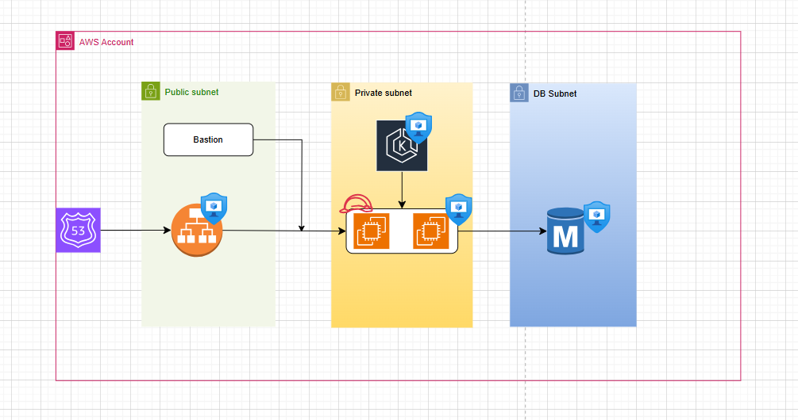

after cluster creation completed, login to bastion host for cluster access using kubectl

we have to run below command to fetch the cluster configuration. it will store config information at ~/.kube/config file

```
aws eks update-kubeconfig --region us-east-1 --name expense-dev
```


Cluster Upgrade:
``````````
communicate with teams that EKS is getting upgraded, no new dployments and release happend
change the SG to remove access to other teams

1. create anothr node group green with same capacity
2. cordon green nodes for not to accept the pods on these nodes

```
kubectl cordon <node-name>
```

3. update control plane to 1.31 version 


4. update node group (green) to 1.31 version

5. cordon blue nodes and uncordon green nodes 

```
kubectl cordon <blue-name>
```

6. drain all blue node group ( scheduler will schedule the pods on green nodes)

```
 kubectl get nodes --show-labels | grep blue
 kubectl drain ip-10-0-11-168.ec2.internal
 kubectl drain ip-10-0-11-168.ec2.internal --ignore-daemonsets
 kubectl drain ip-10-0-12-240.ec2.internal --ignore-daemonsets

```

7. delete blue node group

VM to Containers migration (k8s)

ALB --> listner --> Rule --> Target Group (VM)

ALB --> listner --> Rule --> Target Group (POD)

create ACM, Create ALB, Listener, Rule, Target Group (IP based)


***Load Balancer, Listener, Target Group are created using terraform outside of EKS Cluster. Now we need to map ips of Pods created inside cluster to load balancer target group***

* for that to happend, we need to install AWS LoadBalancer Controller

```
https://kubernetes-sigs.github.io/aws-load-balancer-controller/latest/deploy/installation/
```


* create targegroupBinding

```
apiVersion: elbv2.k8s.aws/v1beta1
kind: TargetGroupBinding
metadata:
  name: my-tgb
spec:
  serviceRef:
    name: awesome-service # route traffic to the awesome-service
    port: 80
  targetGroupARN: <arn-to-targetGroup>
  ```

ref: https://kubernetes-sigs.github.io/aws-load-balancer-controller/v2.1/guide/targetgroupbinding/targetgroupbinding/